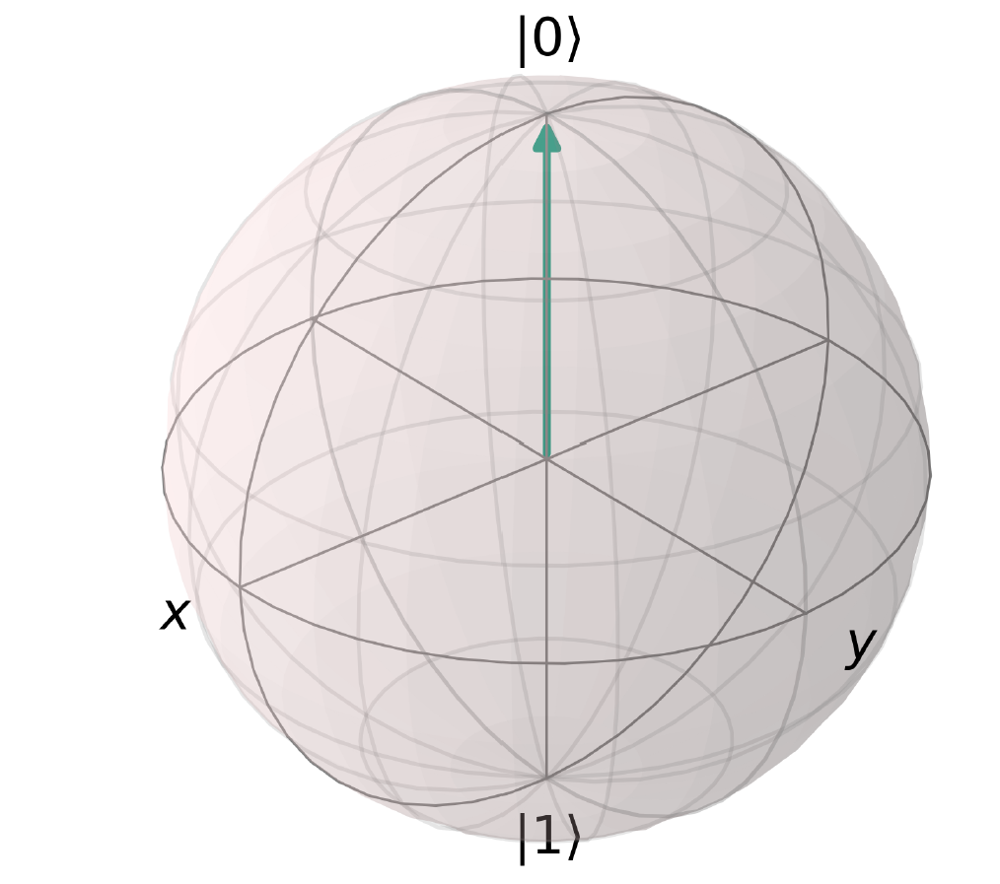
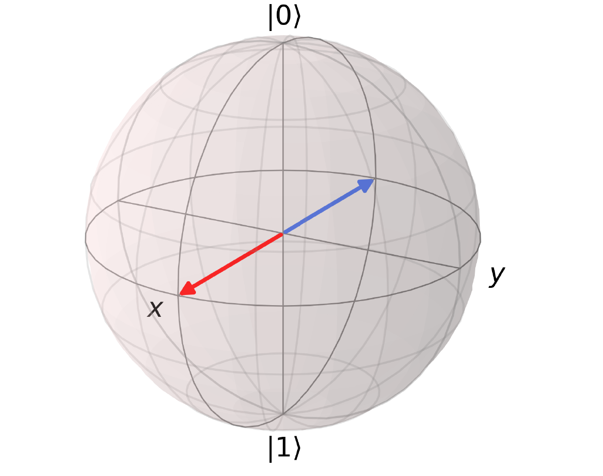

# Mathematical basics 

To understand and envision the concepts of quantum computing, a solid mathematical foundation is necessary.  
Our main topics cover matrices, vectors, complex numbers and probability. If one of these topics is completely unfamiliar to you, we suggest to study the fundamentals elsewhere and come back. However, all sections should be understandable with a high school degree. 

## vectors 

In quantum computing, qubit states are mathematically represented as state vectors. These vectors exist in a complex vector space and use Dirac notation. Unlike classical bits that can only be 0 or 1, quantum state vectors use complex numbers to express probability amplitudes, meaning that the coefficients $\alpha$ and $\beta$ in $$\alpha \ket{0} + \beta \ket{1} = \psi$$ are complex numbers.  
2-Dimensional vectors consist of two 2 components, similar to our quantum states. It seems logical to use this similarity and use vectors to visualize quantum states. The quantum state $0 \ket{0} + 1 \ket{1}$ would be represented in the vector $\vec{v} =\left (\begin{array}{c}0 \\ 1\\ \end{array} \right)$. This vector is often denoted as $\ket{1}$, since it has a 100% 
probability to collapse to 1. Analogous, the state  $1 \ket{0} + 0 \ket{1}$, also  $\vec{v} =\left (\begin{array}{c}1 \\ 0\\ \end{array} \right)$ or just $\ket{0}$. 

A specialty of quantum computing is the braket (yes, I spelled that right), also called Dirac notation. The ket-part represents a column vector and is denoted with a right kink: $\left (\begin{array}{c}\alpha\\\ \beta\\\ \end{array} \right)= \ket{\psi}$ . The corresponding dual vector, a row vector, forms the bra. It looks like a mirrored ket: $\left (\begin{array}{c}\alpha& \beta\\\ \end{array} \right)= \bra{\psi}$. The braket is the combination of both: $\bra{\psi} *\ket{\psi}= \braket{\psi \mid \psi}$. Maybe you have seen the scalar product $\braket{\psi, \phi}$ before, which is mathematically the same thing. 
 Two states are orthogonal, if $\braket{\psi \mid\phi}= 0. \braket{0 \mid 1}$ Satisfy this equation, hence why we chose them as basis vectors. We can write every other vector as a linear combination of these two. Other basis vectors could be chosen, as long as they are orthonormal. 

We can visualize these qubits on the Bloch sphere. It serves as a geometrical representation of the quantum state of a single qubit. Imagine a sphere where each point on the surface corresponds to a unique quantum state. Qubit states can be visualized as points on this sphere, allowing us to comprehend their superposition and entanglement properties. 

|0⟩ and |1⟩ denote the basis states, like a north and south pole. Superposition allows qubits to exist in a combination of these basis states, expressed as linear combinations of state vectors. In the introduction, we discovered the state $\frac{1}{\sqrt{2}} \ket{0} + \frac{1}{\sqrt{2}} \ket{1}$ for the equal superposition. On the Blochsphere, this vector can be represented as: 

Notice how we have two different options: The red vector emerges if we start in the $\ket{0}$ state, the blue one arises after applying to the $\ket{1}$ state. 

So far, we have only talked about single-qubits systems. If we want to look at multiple qubits, we will need to use the Kronecker product $\otimes$. It is defined as: 

$\vec a \otimes \vec b=$ $\left( \begin{array}{rrr}
a_1  b_1 \\\
a_1  b_2  \\\
... \\\
a_1 b_n \\\
a_2 b_1 \\\
...\\\
a_m b_n \end{array}\right)$  

As you can see, the vectors don't need to be of the same dimension (opposing the rules of vector addition or cross product) and the new vector's dimension $dim(v) = dim(a)*dim(b)$. We already established that adding qubits together results in exponential growth of the system, like the dimension of this vector.  
Keep in mind that the Kronecker product does not commute (as the order of qubits mater) and don't confuse it with the Kronecker sum $\oplus$ (which does not change dimensions). 

 ## probability 

 Quantum states, such as those of qubits, are akin to Schrödinger's wavefunctions and are inherently probabilistic. These states are typically represented as probability vectors. This representation is a consequence of the fundamental principle in quantum mechanics that states that, before measurement, a quantum system can exist in a superposition of multiple states. Probability vectors precisely capture this superposition.

 All vectors we considered so far are probability vectors, meaning that their components carry the probability for the wave function to collapse in this specific state. Therefore, all state vectors are normalized, to sum up to 100%. In other words, it guarantees that when you measure a quantum system, one of the possible outcomes will indeed occur. It's a fundamental requirement for quantum states.

Probability amplitudes, denoted by α and β in our example, are complex numbers that underlie quantum probability vectors. They encapsulate not only the probability of measuring a particular outcome but also the phase information, a key aspect of quantum states. This complex nature of amplitudes is crucial in quantum interference phenomena.

When you measure a quantum system, the probability vector dictates the likelihood of each possible measurement outcome. The Born rule (named after physicist Max Born) quantifies this relationship between probability amplitudes and measurement probabilities. It states that the probability of measuring a state $|\psi⟩$ in a basis state $|x⟩$ is given by $|⟨x|ψ⟩|^2$.

### Interlude: Phases and amplitudes 

We have already been throwing around these words, without actually explaining them. 

Amplitudes are more potent than regular probabilities and therefore useful to describe complex quantum phenomena. Like any probability, probability amplitudes have a magnitude, implying how likely an event occurs. Additionally, amplitudes have an angle and a direction. You can imagine the amplitude like a vector, having a specific length (magnitude), direction, and an angle measuring from a basis vector (phase). This phase will be very useful later on, so don't forget it!

Relative phase refers to the phase difference between the probability amplitudes of different quantum states. It emerges when quantum states are in superposition, meaning they exist in a combination of basis states. The relative phase is the relative angle or phase shift between the probability amplitudes of these states. It can take any value between $0- 2\pi$ and it influences the interference of quantum states during measurements. In quantum algorithms, manipulating the relative phase is a fundamental technique.

The global phase doesn't change the physical state, but rather shifts the entire solution for a constant factor. The states $\braket{\psi}$ and $e^{i \theta}\braket{\phi}$ describe the same observable state (in this case, the phase is $\theta$. We know that it is a global phase since it is multiplied on the outer side of the wave funtion). Often times, global phase is neglected for that reason. 

## Matrices 

At their core, all fundamental quantum gates can be represented as a matrix. If you are completely new to the topic, tutorials like [the Khan Academy](https://www.khanacademy.org/math/linear-algebra) give a good overview. 
You can imagine a matrix like an operation acting on a vector: It can change its direction, rotate it, shrink or elongate it.  

The transpose of a matrix switches the rows and columns, often resulting in a matrix of different dimension. For example:  
$A=$ $\left( \begin{array}{rrr}
4 & 1 \\
6 & 2  \\
\end{array}\right)$
$A^{T}=$ $\left( \begin{array}{rrr}
4 & 6 \\
1 & 2  \\
\end{array}\right)$ or 
$B=$ $\left( \begin{array}{rrr}
a & b \\
c & d  \\
e & f \\
\end{array}\right)$
$B^T=$ $\left( \begin{array}{rrr}
a & c & e \\
b & d & f \\
\end{array}\right)$

As you can see, the diagonal stays identical, therefore the transpose could also be described as a reflection at the diagonal. 

The complex conjugate changes the signs before every complex number. Real matrices stay unaffected by this measure. 
$A=$ $\left( \begin{array}{rrr}
4 & i \\
6+2i & 2  \\
\end{array}\right)$
$A^{*}= \=A =$ $\left( \begin{array}{rrr}
4 & -i \\
6-2i & 2  \\
\end{array}\right)$  
To avoid confusion with the unitary symbol, the complex conjugate (without transpose) is described with $\=A$. 

A matrix is called **unitary** if their conjugate transpose equals its inverse: $UU^*= UU^{-1}= I$. In quantum mechanics, unitary matrices are often denoted with a dagger: $U^{\dag}$.
For quantum computing, all matrices need to be unitary. That way, the norm is preserved, since we want all our probability vectors to have a norm of 1 (aka 100%). 

For a **Hermitian** matrix, the complex conjugate transpose equals the matrix itself (in contrast to the inverse for unitary matrices).  A simple example is the identity matrix, whose rows and columns are identical and have no complex numbers.  

 Both of these operations are involutionary, meaning that doing them twice results in the original matrix: $(U^{\dag})^{\dag} = U$ and $(U^T)^T = U$. 

 To have a function ("gate") act on a qubit, the mathematical formulation is to take the vector corresponding to the qubit state and multiply the matrix for the gate. For example, if we start in the state $\ket{0}= \left (\begin{array}{c}
    1\\ 0\\ 
    \end{array} \right)$
and want to apply a X-gate, also called bitflip, we would multiply the equivalent matrix $\left(\begin{array}{rrr}0&1\\\1& 0\\\end{array} \right)$: 
$\left (\begin{array}{rrr}
    0 & 1\\
    1 & 0\\
\end{array} \right) *
\left (\begin{array}{c}
    1\\ 0\\ 
    \end{array} \right ) =
    \left 
(\begin{array}{c}
    0*1+1*0 \\
    1*1 + 0*0\\
\end{array} \right) = 
\left(\begin{array}{c}
    0 \\
    1\\
\end{array}  \right)$

 For every matrix, an **eigenvalue** $\lambda$ can be determined, expressed as $M * v = \lambda * v$, meaning that the eigenvector scales the eigenvector $v$ the same way that the matrix $M$ does. Typically, the eigenvalue is calculated by solving the characteristic equation $| M - \lambda I | = 0$ with the identity matrix $I$. 
 For example, the characteristic equation for the matrix 
$C=$ $\left( \begin{array}{rrr}3  & 7 \\
1 & 3  \\
\end{array}\right)$ 

$| M - \lambda I | = 0=
\left( \begin{array}{rrr}3  & 7 \\
1 & 3  \\
\end{array}\right)-\left( \begin{array}{rrr} \lambda  & 0 \\
0 & \lambda  \\
\end{array}\right) =
 \left( \begin{array}{rrr}3 - \lambda  & 7 \\
1 & 3 - \lambda  \\
\end{array}\right) =(3-\lambda)^2 -7$ 
$\lambda = 3 \plusmn \sqrt{7}$

Eigenvectors, on the other hand, are the vectors that remain in the same direction (up to scaling) when multiplied by the matrix. They are crucial in quantum computing because certain quantum gates are essentially rotations or transformations that operate on the eigenvectors of a quantum system.
The eigenvectors are found by completing the equations $(M - \lambda I) *v =0$. 

## Summary

+ the coefficients $\alpha$ , $\beta$ $\epsilon$ $\Complex$ in the equation $\ket{\psi}=\alpha\ket{0}+\beta\ket{1}$ can be represented as a state vector $\vec v = \left (\begin{array}{c}
    \alpha^2 \\\ \beta^2\end{array} \right)$ and visualized on the Blochsphere
+ to combine multiple qubits, the Kronecker product $\vec a \otimes \vec b$ is used 
+ all operations in quantum computing can be broken down to unitary matrices: $U^*= U^{-1}$
+ To apply an operation onto a qubits, the multiplication 
$\ket{\psi'}=U\ket{\psi}$ is performed 

